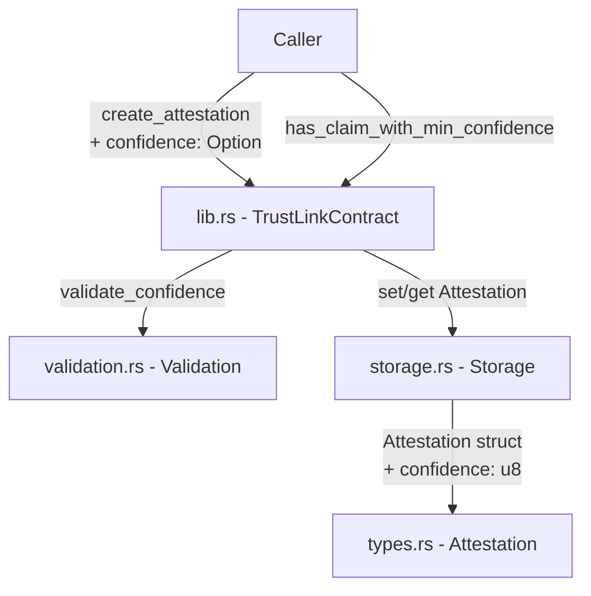

# Design Document: Attestation Confidence Score

## Overview

This feature adds a numeric confidence score (0–100) to the `Attestation` struct, allowing issuers to express the assurance level of each attestation they create. A new query function `has_claim_with_min_confidence` lets verifiers filter claims by a minimum confidence threshold.

The change is purely additive: existing callers of `create_attestation` that omit the confidence argument receive a default of `100`, preserving all current behavior. The `has_valid_claim` function is unchanged.

## Architecture

The feature touches four layers of the TrustLink contract:



The confidence value flows in at creation time, is validated before any fee is charged or storage is written, stored inside the `Attestation` record, and read back during the new query.

## Components and Interfaces

### types.rs — Attestation struct

Add a `confidence: u8` field to `Attestation`. Because `#[contracttype]` structs are serialized by field position in XDR, the new field is appended at the end to avoid breaking existing stored records (Soroban's XDR encoding for `contracttype` structs is positional, so appending is safe for new records; old records without the field will be handled via the backward-compatibility default described below).

```rust
#[contracttype]
#[derive(Clone, Debug, Eq, PartialEq)]
pub struct Attestation {
    // ... existing fields ...
    pub confidence: u8,   // NEW — range [0, 100]; default 100
}
```

Add a new error variant:

```rust
#[contracterror]
pub enum Error {
    // ... existing variants ...
    InvalidConfidence = 21,
}
```

### validation.rs — Validation::require_valid_confidence

A new guard that rejects values above 100:

```rust
pub fn require_valid_confidence(confidence: u8) -> Result<(), Error> {
    if confidence > 100 {
        Err(Error::InvalidConfidence)
    } else {
        Ok(())
    }
}
```

Because `u8` has a maximum of 255, only values 101–255 are invalid. The check is a single comparison.

### lib.rs — create_attestation signature change

The `confidence` parameter is added as `Option<u8>`. `None` defaults to `100`.

```rust
pub fn create_attestation(
    env: Env,
    issuer: Address,
    subject: Address,
    claim_type: String,
    expiration: Option<u64>,
    metadata: Option<String>,
    tags: Option<Vec<String>>,
    confidence: Option<u8>,   // NEW
) -> Result<String, Error>
```

Validation order (unchanged for existing checks, confidence inserted before fee):

1. `issuer.require_auth()`
2. `Validation::require_issuer`
3. `validate_metadata`
4. `validate_tags`
5. `validate_native_expiration`
6. **`Validation::require_valid_confidence`** ← new, before fee charge
7. `charge_attestation_fee`
8. Store attestation

### lib.rs — has_claim_with_min_confidence

New public function:

```rust
pub fn has_claim_with_min_confidence(
    env: Env,
    subject: Address,
    claim_type: String,
    min_confidence: u8,
) -> bool
```

Iterates the subject's attestation IDs, finds any with matching `claim_type` and `AttestationStatus::Valid`, and returns `true` if `attestation.confidence >= min_confidence`. Returns `false` otherwise.

### Backward Compatibility — old attestations

Attestations stored before this feature was deployed will not have a `confidence` field in their XDR. When `Storage::get_attestation` deserializes such a record, the missing field will cause a deserialization failure. To handle this gracefully, a wrapper `get_attestation_with_confidence_default` can be used internally that falls back to confidence `100` on deserialization error, or alternatively the field can be stored as `Option<u8>` internally and resolved to `100` at query time.

The chosen approach: store `confidence` as a plain `u8` in new records (clean API), and in `has_claim_with_min_confidence` use a try-based deserialization that defaults to `100` for records that predate this feature. The `get_attestation` public function will return the stored value for new records; for old records it will return `100` via the fallback.

## Data Models

### Updated Attestation struct

| Field | Type | Notes |
|---|---|---|
| id | String | unchanged |
| issuer | Address | unchanged |
| subject | Address | unchanged |
| claim_type | String | unchanged |
| timestamp | u64 | unchanged |
| expiration | Option\<u64\> | unchanged |
| revoked | bool | unchanged |
| metadata | Option\<String\> | unchanged |
| valid_from | Option\<u64\> | unchanged |
| imported | bool | unchanged |
| bridged | bool | unchanged |
| source_chain | Option\<String\> | unchanged |
| source_tx | Option\<String\> | unchanged |
| tags | Option\<Vec\<String\>\> | unchanged |
| **confidence** | **u8** | **NEW — [0, 100], default 100** |

### Error enum additions

| Variant | Code | Meaning |
|---|---|---|
| InvalidConfidence | 21 | confidence > 100 passed to create_attestation |

### create_attestation parameter delta

| Parameter | Before | After |
|---|---|---|
| confidence | absent | `Option<u8>` — `None` → stored as `100` |


## Correctness Properties

*A property is a characteristic or behavior that should hold true across all valid executions of a system — essentially, a formal statement about what the system should do. Properties serve as the bridge between human-readable specifications and machine-verifiable correctness guarantees.*

### Property 1: Confidence round-trip

*For any* confidence value `c` in [0, 100], creating an attestation with that confidence value and then retrieving it via `get_attestation` should return an attestation whose `confidence` field equals `c`.

**Validates: Requirements 1.2, 1.4**

### Property 2: Invalid confidence rejected

*For any* `u8` value `c` greater than 100 (i.e., 101–255), calling `create_attestation` with that value should return `Error::InvalidConfidence` and no attestation should be stored.

**Validates: Requirements 2.1**

### Property 3: Valid confidence accepted

*For any* confidence value `c` in [0, 100], calling `create_attestation` should succeed (not return an error) and the resulting attestation should be retrievable.

**Validates: Requirements 2.2**

### Property 4: has_claim_with_min_confidence threshold

*For any* subject with a valid (non-revoked, non-expired) attestation of a given `claim_type` with confidence `c`, and *for any* `min_confidence` value `m`, `has_claim_with_min_confidence` should return `true` if and only if `c >= m`.

**Validates: Requirements 3.1, 3.2, 3.3**

### Property 5: Revoked or expired attestations never satisfy confidence query

*For any* attestation that is either revoked or expired, calling `has_claim_with_min_confidence` with `min_confidence = 0` (which would match any confidence level) should return `false`.

**Validates: Requirements 3.4**

### Property 6: has_valid_claim is confidence-agnostic

*For any* subject and claim type, the result of `has_valid_claim` should be the same regardless of the confidence value stored on the matching attestation — i.e., creating an attestation with confidence 0 vs confidence 100 should produce the same `has_valid_claim` result.

**Validates: Requirements 4.2**

## Error Handling

| Scenario | Error returned | When |
|---|---|---|
| `confidence > 100` passed to `create_attestation` | `Error::InvalidConfidence` (21) | Before fee charge, before storage write |
| All other existing error conditions | Unchanged | Unchanged |

The confidence check is inserted at position 6 in the validation sequence (after tag/metadata/expiration checks, before fee charge). This ensures no side effects occur for invalid inputs.

For `has_claim_with_min_confidence`, no new errors are introduced — the function returns `bool` and handles missing or undeserializable attestations by treating them as non-matching (returns `false`).

## Testing Strategy

### Dual Testing Approach

Both unit tests and property-based tests are required. Unit tests cover specific examples and edge cases; property tests verify universal correctness across randomized inputs.

### Property-Based Testing Library

Use **`proptest`** (crate `proptest = "1"`), the standard property-based testing library for Rust. Each property test runs a minimum of **100 iterations**.

Each property test must be tagged with a comment in the format:
`// Feature: attestation-confidence-score, Property N: <property text>`

### Property Tests

Each correctness property maps to exactly one property-based test:

| Property | Test name | Generator |
|---|---|---|
| P1: Confidence round-trip | `prop_confidence_round_trip` | `confidence: u8` in `0..=100` |
| P2: Invalid confidence rejected | `prop_invalid_confidence_rejected` | `confidence: u8` in `101..=255` |
| P3: Valid confidence accepted | `prop_valid_confidence_accepted` | `confidence: u8` in `0..=100` |
| P4: Threshold query | `prop_has_claim_with_min_confidence_threshold` | `(confidence: u8 in 0..=100, min_confidence: u8 in 0..=100)` |
| P5: Revoked/expired return false | `prop_revoked_expired_confidence_false` | `confidence: u8 in 0..=100`, then revoke or expire |
| P6: has_valid_claim ignores confidence | `prop_has_valid_claim_ignores_confidence` | two confidence values `a, b` in `0..=100` |

### Unit Tests

Unit tests focus on specific examples and edge cases not covered by property tests:

- **Default confidence is 100**: call `create_attestation` with `confidence = None`, assert stored `confidence == 100`
- **Validation before fee**: set a non-zero fee, call with `confidence = 101`, assert `InvalidConfidence` returned and fee collector balance unchanged
- **Other fields unaffected**: create attestation with explicit confidence, assert all other fields (`issuer`, `subject`, `claim_type`, `metadata`, `tags`, etc.) are unchanged
- **Backward compatibility edge case**: simulate an old attestation (imported with no confidence field) and verify `has_claim_with_min_confidence` treats it as confidence 100
- **Boundary values**: explicitly test `confidence = 0`, `confidence = 100`, `confidence = 101` as boundary examples
