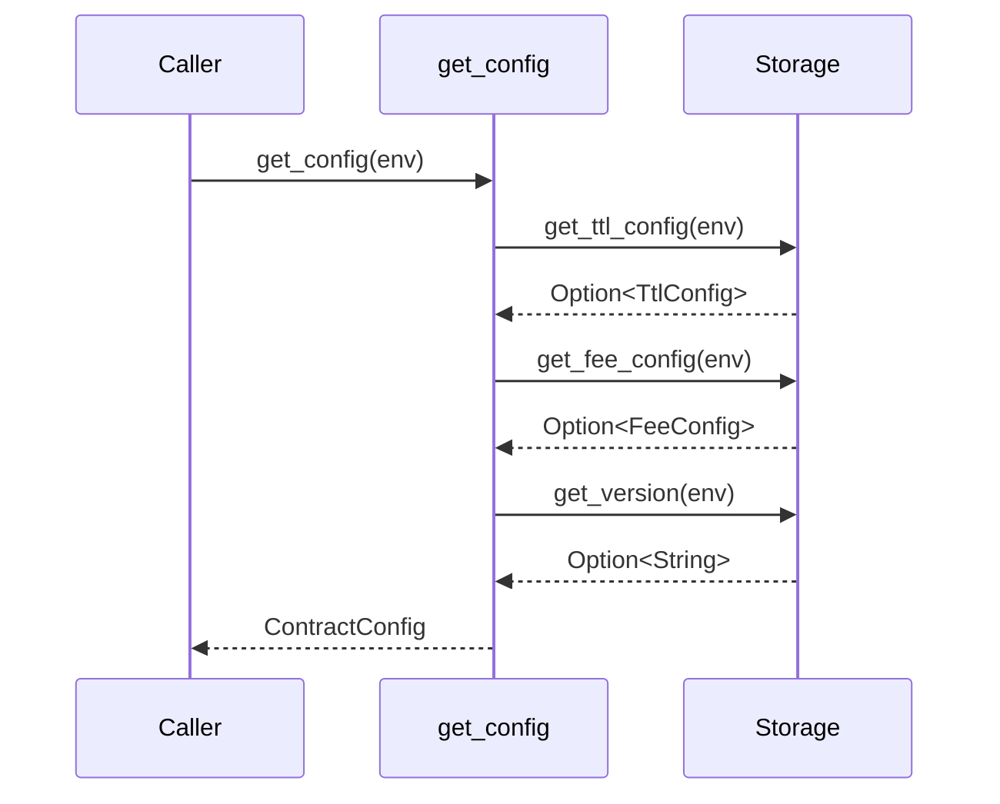

# Design Document: contract-config-query

## Overview

This feature adds a `get_config` entry point to TrustLink that aggregates the contract's existing configuration — `TtlConfig`, `FeeConfig`, and contract identity metadata — into a single `ContractConfig` response. The change is purely additive: no existing storage layout, entry points, or enforcement logic is modified.

The motivation is ergonomics for integrators. Today, reading the full contract configuration requires three separate calls (`get_fee_config`, `get_version`/`get_contract_metadata`, and a direct storage read for `TtlConfig`). `get_config` collapses these into one.

## Architecture

The feature touches three files:

```
src/types.rs     — add ContractConfig struct
src/storage.rs   — add Storage::get_ttl_config() helper
src/lib.rs       — add get_config() entry point
```

No new storage keys, no new storage tiers, and no new error variants are required. `get_config` is a pure read that delegates to the same storage helpers already used by the existing individual query functions.



## Components and Interfaces

### `ContractConfig` (new type in `src/types.rs`)

```rust
#[contracttype]
#[derive(Clone, Debug, Eq, PartialEq)]
pub struct ContractConfig {
    pub ttl_config: TtlConfig,
    pub fee_config: FeeConfig,
    pub contract_name: String,
    pub contract_version: String,
    pub contract_description: String,
}
```

Uses the existing `TtlConfig` and `FeeConfig` types verbatim — no duplication.

### `Storage::get_ttl_config` (new helper in `src/storage.rs`)

```rust
pub fn get_ttl_config(env: &Env) -> Option<TtlConfig> {
    env.storage().instance().get(&StorageKey::TtlConfig)
}
```

Mirrors the existing `get_fee_config` pattern. Exposes the `TtlConfig` that is already written by `set_ttl_config` during `initialize`.

### `TrustLinkContract::get_config` (new entry point in `src/lib.rs`)

```rust
pub fn get_config(env: Env) -> ContractConfig {
    let ttl_config = Storage::get_ttl_config(&env)
        .unwrap_or(TtlConfig { ttl_days: 30 });

    let fee_config = Storage::get_fee_config(&env)
        .unwrap_or_else(|| FeeConfig {
            attestation_fee: 0,
            fee_collector: env.current_contract_address(),
            fee_token: None,
        });

    let version = Storage::get_version(&env)
        .unwrap_or_else(|| String::from_str(&env, ""));

    ContractConfig {
        ttl_config,
        fee_config,
        contract_name: String::from_str(&env, "TrustLink"),
        contract_version: version,
        contract_description: String::from_str(
            &env,
            "On-chain attestation and verification system for the Stellar blockchain.",
        ),
    }
}
```

The function is infallible (`-> ContractConfig`, not `Result`) because it always has a sensible answer: either the stored value or a well-defined default. This matches the requirement that uninitialized contracts return defaults rather than an error.

The `contract_name` and `contract_description` are compile-time constants (same strings used in `get_contract_metadata`), so they are always available regardless of initialization state.

## Data Models

### `ContractConfig` field sources

| Field | Storage key | Default (uninitialized) |
|---|---|---|
| `ttl_config` | `StorageKey::TtlConfig` (instance) | `TtlConfig { ttl_days: 30 }` |
| `fee_config` | `StorageKey::FeeConfig` (instance) | `FeeConfig { attestation_fee: 0, fee_collector: current_contract_address(), fee_token: None }` |
| `contract_name` | hardcoded constant | `"TrustLink"` |
| `contract_version` | `StorageKey::Version` (instance) | `""` (empty string) |
| `contract_description` | hardcoded constant | `"On-chain attestation and verification system for the Stellar blockchain."` |

All fields are sourced from instance storage (or compile-time constants), which is consistent with how `get_fee_config` and `get_contract_metadata` already operate.

### Consistency with existing queries

`get_config` must return values identical to the existing individual queries for any initialized contract state:

| `get_config` field | Equivalent existing query |
|---|---|
| `ttl_config` | `Storage::get_ttl_config` (new helper, same key) |
| `fee_config` | `get_fee_config(env)` |
| `contract_name` | `get_contract_metadata(env).name` |
| `contract_version` | `get_contract_metadata(env).version` |
| `contract_description` | `get_contract_metadata(env).description` |

## Correctness Properties

*A property is a characteristic or behavior that should hold true across all valid executions of a system — essentially, a formal statement about what the system should do. Properties serve as the bridge between human-readable specifications and machine-verifiable correctness guarantees.*

### Property 1: get_config is consistent with individual query functions

*For any* initialized contract state, the `ttl_config`, `fee_config`, `contract_name`, `contract_version`, and `contract_description` fields returned by `get_config` shall equal the values returned by `Storage::get_ttl_config`, `get_fee_config`, and `get_contract_metadata` respectively.

**Validates: Requirements 3.1, 3.2, 3.3**

### Property 2: get_config is idempotent and does not mutate state

*For any* contract state, calling `get_config` twice in succession with no intervening state changes shall return two `ContractConfig` values that are structurally equal, and the contract state after both calls shall be identical to the state before either call.

**Validates: Requirements 2.2, 4.1**

### Property 3: Initialized values round-trip through get_config

*For any* valid initialization parameters `(ttl_days, fee, collector, fee_token)`, after calling `initialize` with those parameters, `get_config` shall return a `ContractConfig` whose `ttl_config.ttl_days`, `fee_config.attestation_fee`, `fee_config.fee_collector`, and `fee_config.fee_token` fields equal the initialization inputs.

**Validates: Requirements 2.1, 2.3**

*Edge case — uninitialized defaults*: When `get_config` is called on a contract that has never been initialized, it shall return `ttl_days = 30`, `attestation_fee = 0`, `fee_token = None`, `contract_version = ""`, and the hardcoded name/description strings. (Validates: Requirement 2.4)

## Error Handling

`get_config` is intentionally infallible. Rather than propagating `Error::NotInitialized`, it returns well-defined defaults for every field. This design decision:

- Keeps the caller API simple (no `Result` unwrapping needed for a read-only query).
- Matches the spirit of the requirement: "return the contract's default values" rather than "return an error".
- Is consistent with how `Storage::get_subject_attestations` and similar helpers already return empty defaults rather than errors when data is absent.

No new error variants are introduced.

## Testing Strategy

### Unit tests

Unit tests cover specific examples and the uninitialized edge case:

- **Uninitialized defaults**: Call `get_config` on a fresh contract; assert each field equals its documented default.
- **Post-initialization values**: Initialize with specific `ttl_days`, fee, and collector; call `get_config`; assert all fields match.
- **Consistency snapshot**: After initialization, assert `get_config().fee_config == get_fee_config()` and `get_config().ttl_config == Storage::get_ttl_config()` and metadata fields match `get_contract_metadata()`.

### Property-based tests

Use the [`proptest`](https://github.com/proptest-rs/proptest) crate (already common in Soroban test suites) with a minimum of 100 iterations per property.

Each test is tagged with a comment in the format:
`// Feature: contract-config-query, Property <N>: <property_text>`

**Property 1 test** — consistency with individual queries:
Generate random `(ttl_days: u32, fee: i128 >= 0, collector: Address)` tuples. For each: initialize the contract, call `get_config`, call the individual query functions, assert field-by-field equality.
`// Feature: contract-config-query, Property 1: get_config is consistent with individual query functions`

**Property 2 test** — idempotence / no mutation:
Generate random initialized contract states. Call `get_config` twice; assert the two results are equal. Optionally snapshot instance storage keys before and after to assert no writes occurred.
`// Feature: contract-config-query, Property 2: get_config is idempotent and does not mutate state`

**Property 3 test** — round-trip through initialization:
Generate random valid initialization inputs. Initialize, call `get_config`, assert the config fields match the inputs.
`// Feature: contract-config-query, Property 3: Initialized values round-trip through get_config`

Unit tests and property tests are complementary: unit tests pin down the exact default values and specific integration points; property tests verify the general correctness rules hold across the full input space.
